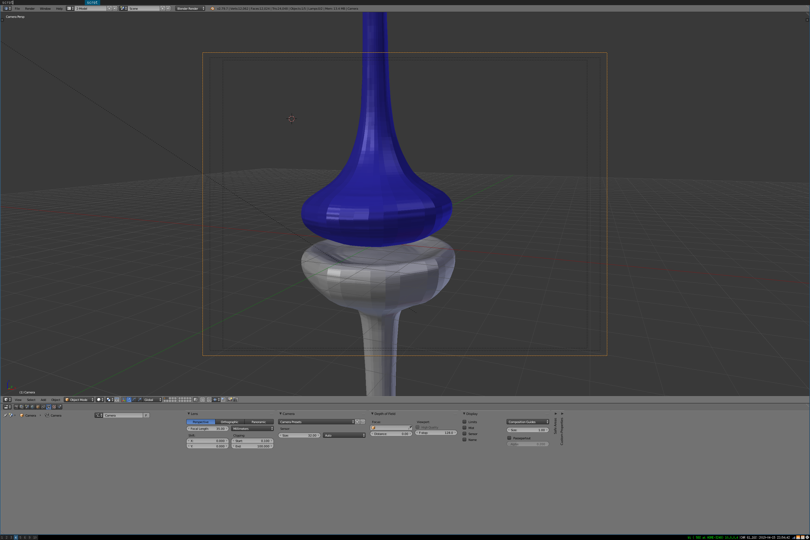

# SynapseModel
A 3d model of the synapse and associated scripts to import into smoldyn. Made in Blender circa 2010. Unclear if it still works perfectly in current (post 2018) version os Blender.

## Visualizations

The model is pretty straightforward with a pre-synaptic surface and a post-synaptic surface.

## Next steps
Need to add a transparent surface for the astrocytic surface.
