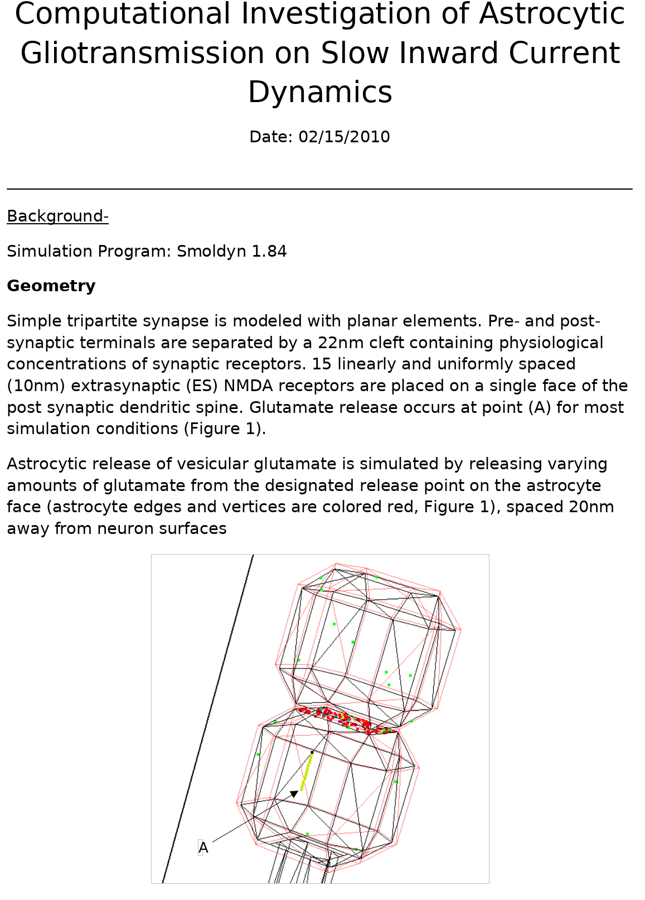

# SynapseModel
A 3d model of the synapse and associated scripts to import into smoldyn. Made in Blender circa 2010. Unclear if it still works perfectly in current (post 2018) version os Blender.

## Background
This work is based off of my thesis work modeling astrocytic release of neurotransmitter into the synaptic cleft. I focused on glutamatergic signaling, specifically NMDA receptors with variable subunits, depending on their location in either the synaptic space or the extrasynaptic space.

Basically; each synapse could be a transistor where small astrocytic releases of glutamate could have large impact on neuron-neuron signaling.

More information can be found in my thesis (circa 2011) here: [TBD]()

The model itself was implemented in Smoldyn and can be seen below:

## Visualizations

The model is pretty straightforward with a pre-synaptic surface and a post-synaptic surface.

## Next steps
Need to add a transparent surface for the astrocytic surface.
